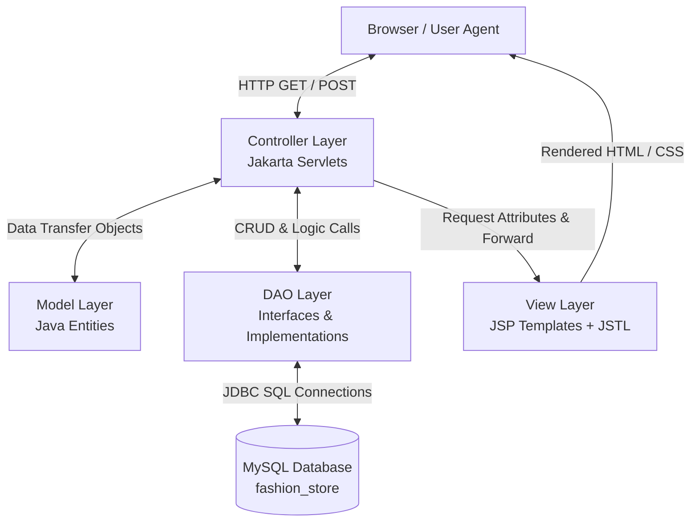

# FashionStore E-Commerce Architecture & Software Engineering Documentation

Welcome to the central technical documentation suite for **FashionStore**, a modern, lightweight Java Enterprise E-Commerce web application built using the Jakarta EE MVC design pattern, MySQL, and JSTL.

> [!NOTE]
> This documentation suite is designed for software architects, full-stack engineers, database administrators, and QA teams requiring deep insights into system design, database schemas, flow interactions, and component mappings.

---

## 📚 Documentation Index

| Document | Description | Key Contents |
| :--- | :--- | :--- |
| 🏗️ **[System Architecture](file:///d:/FEB_B2/ADV_febBatchWorlspace/FashionStore/docs/architecture.md)** | MVC Pattern, Class Diagrams & Sequence Diagrams | High-level MVC topology, Model/DAO/Servlet class hierarchies, 5 complete Sequence Diagrams (Auth, Browsing/Filtering, Cart Operations, Transactional Checkout, Order Management). |
| 🗄️ **[Database Schema & ORM Mapping](file:///d:/FEB_B2/ADV_febBatchWorlspace/FashionStore/docs/database_schema.md)** | ER Diagram, Tables & Data Mappings | Full Entity-Relationship Diagram (ERD), Table Schemas (types, constraints, keys), Foreign Key relationships, and Java Model-to-SQL mapping matrix. |
| 🔄 **[Controller-to-DAO Mapping](file:///d:/FEB_B2/ADV_febBatchWorlspace/FashionStore/docs/controller_dao_mapping.md)** | Interaction Matrix & Servlet Logic | Matrix mapping Servlets to DAOs, `@WebServlet` URL mappings, HTTP methods (`GET`/`POST`), parameter parsing, session controls, and view rendering. |

---

## 🛠️ Technology Stack Matrix

| Component | Technology | Version / Specification |
| :--- | :--- | :--- |
| **Java Platform** | OpenJDK Java | 21 (LTS) |
| **Servlet Engine** | Jakarta Servlet API | 5.0.0 |
| **View Template** | Jakarta Server Pages (JSP) + JSTL | JSP 3.1.0 / JSTL 3.0.1 |
| **Database** | MySQL Server | 8.0+ / 9.x |
| **JDBC Driver** | MySQL Connector/J | 9.4.0 |
| **Security** | BCrypt Password Hashing | org.mindrot:jbcrypt 0.4 |
| **Build & Packaging** | Apache Maven | WAR Packaging |

---

## 📐 High-Level Architecture Overview

FashionStore strictly enforces the **Model-View-Controller (MVC)** architectural pattern:

---

## 🔑 Key Architectural Features

1. **Strict Interface-Driven DAO Pattern**: Decouples SQL persistence logic from Servlet HTTP request handlers.
2. **ACID Transaction Management**: Order processing in `CheckoutDAOImpl` uses manual transaction boundaries (`setAutoCommit(false)`), pessimistic table locking (`FOR UPDATE`), and automatic rollback on failures.
3. **Robust Security**: Passwords are standard-hashed using `jbcrypt` before storage (`PasswordUtility`).
4. **Session-Based State Control**: Secure HTTP Session management handles user authentication state, cart lookup, and authorization checks.
