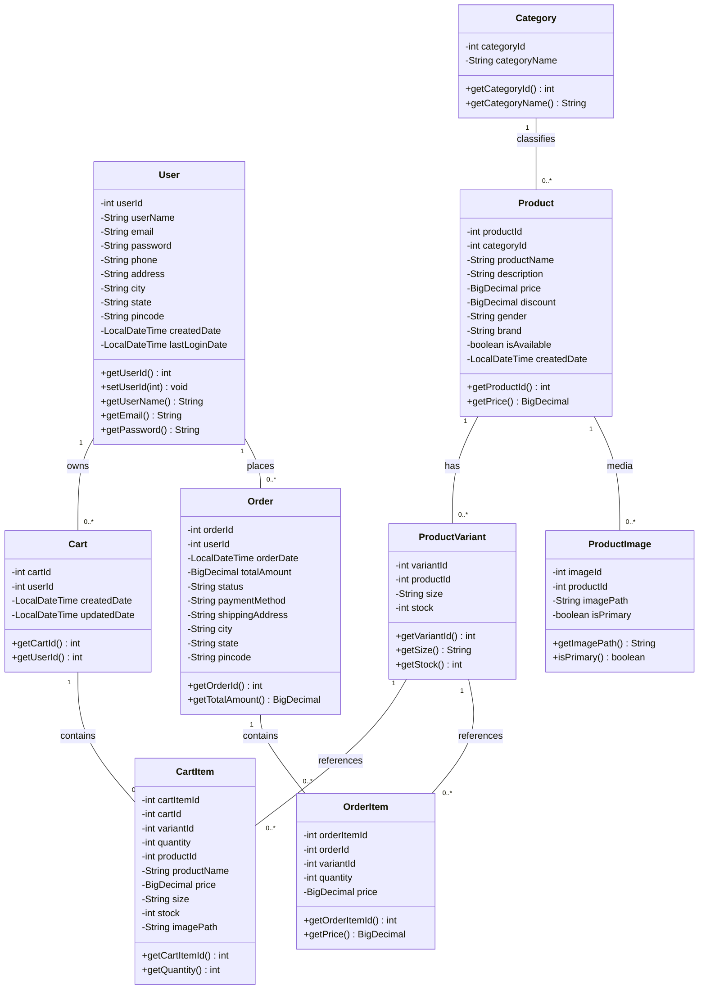
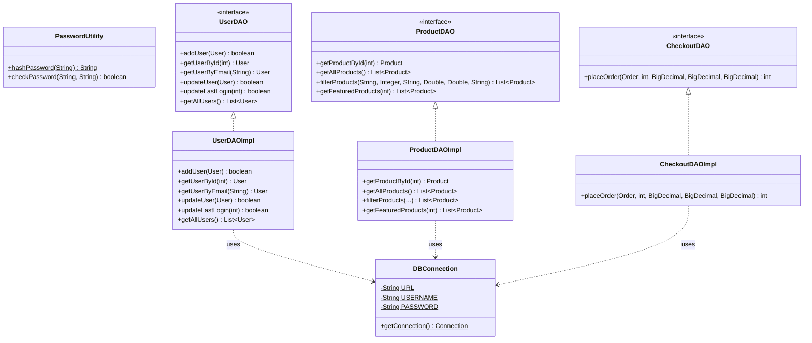
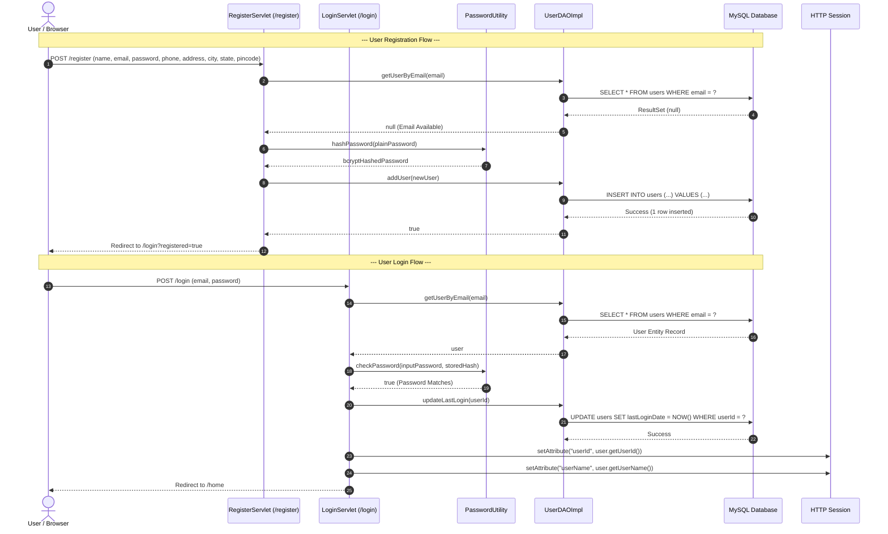
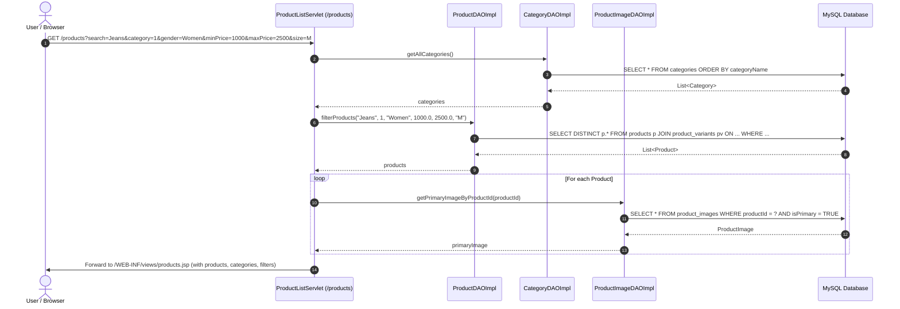
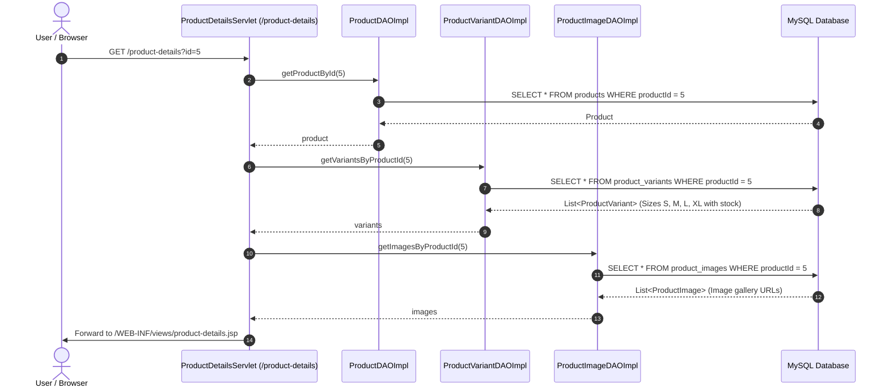
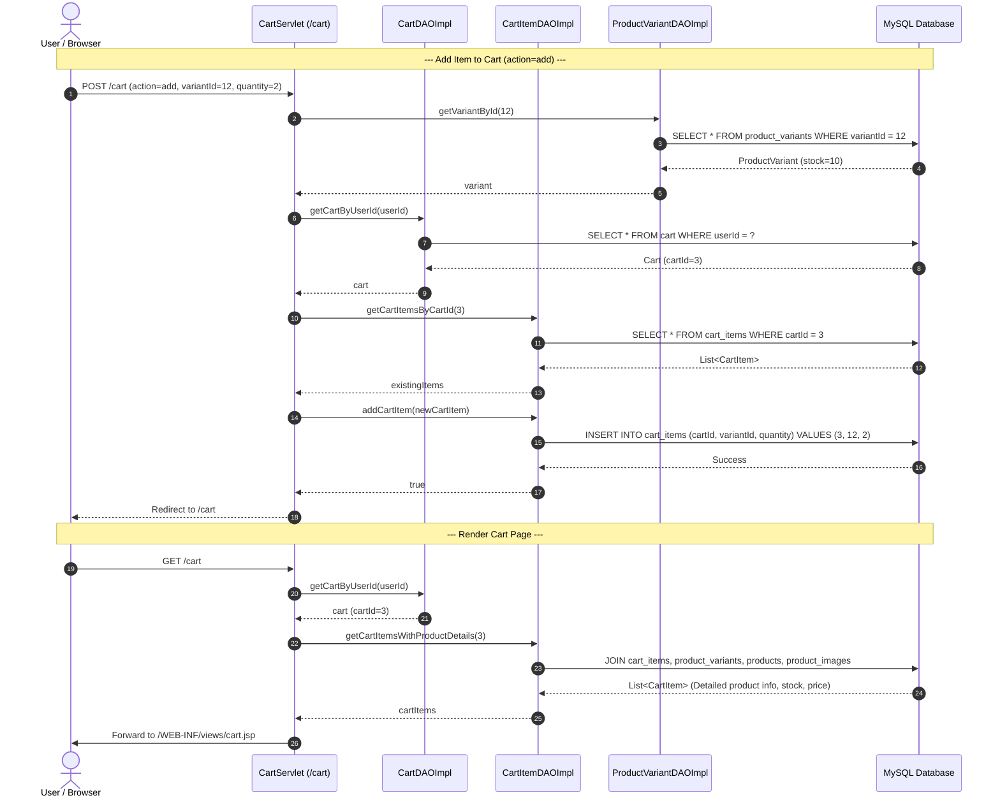
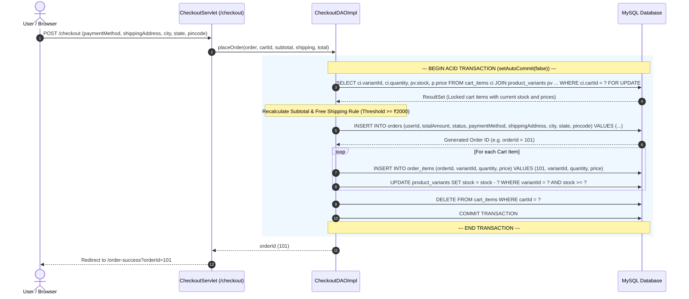
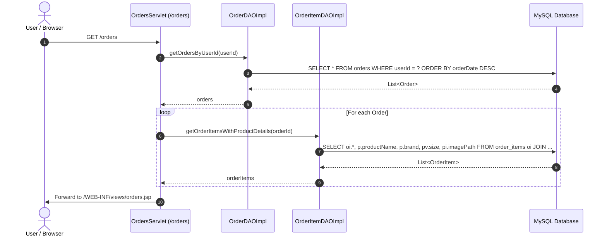
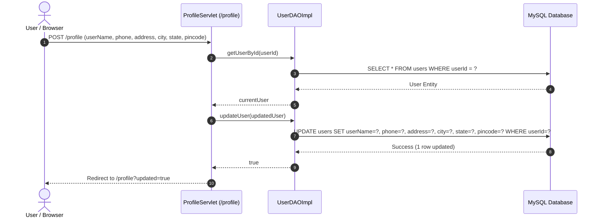

# 🏗️ System Architecture & Flow Sequence Documentation

This document describes the architectural design pattern, package component topology, class diagrams, and end-to-end sequence diagrams for all functional workflows in the **FashionStore** Java Web Application.

---

## 🏛️ Model-View-Controller (MVC) Architectural Pattern

FashionStore implements a clean, layered **Model-View-Controller (MVC)** architecture built on the Jakarta EE Enterprise Web Standard:

```mermaid
graph TB
    subgraph Client Tier
        UserAgent[🌐 Client Browser / User Agent]
    end

    subgraph Controller Tier (com.fashionstore.controller)
        HomeSvc[HomeServlet /home]
        ProdListSvc[ProductListServlet /products]
        ProdDetSvc[ProductDetailsServlet /product-details]
        CartSvc[CartServlet /cart]
        CheckSvc[CheckoutServlet /checkout]
        OrdSvc[OrdersServlet /orders]
        OrdSuccSvc[OrderSuccessServlet /order-success]
        AuthSvc[LoginServlet /login & RegisterServlet /register]
        ProfSvc[ProfileServlet /profile]
    end

    subgraph Service / Data Access Tier (com.fashionstore.dao)
        UserDAO[UserDAO / UserDAOImpl]
        CatDAO[CategoryDAO / CategoryDAOImpl]
        ProdDAO[ProductDAO / ProductDAOImpl]
        VarDAO[ProductVariantDAO / ProductVariantDAOImpl]
        ImgDAO[ProductImageDAO / ProductImageDAOImpl]
        CartDAO[CartDAO / CartDAOImpl]
        CartItemDAO[CartItemDAO / CartItemDAOImpl]
        CheckDAO[CheckoutDAO / CheckoutDAOImpl]
        OrdDAO[OrderDAO / OrderDAOImpl]
        OrdItemDAO[OrderItemDAO / OrderItemDAOImpl]
    end

    subgraph Model Tier (com.fashionstore.model)
        User[User]
        Product[Product]
        Category[Category]
        Variant[ProductVariant]
        Image[ProductImage]
        Cart[Cart]
        CartItem[CartItem]
        Order[Order]
        OrderItem[OrderItem]
    end

    subgraph Presentation Tier (WEB-INF/views)
        JSPViews[JSP Views & Partials<br/>home.jsp, products.jsp, product-details.jsp,<br/>cart.jsp, checkout.jsp, orders.jsp, etc.]
    end

    subgraph Database Tier (MySQL 8.0+)
        MySQL[(MySQL Database<br/>fashion_store)]
    end

    UserAgent -->|HTTP GET/POST Requests| Controller Tier
    Controller Tier -->|Instantiates / Invokes| Service / Data Access Tier
    Service / Data Access Tier -->|Maps Data To / From| Model Tier
    Service / Data Access Tier -->|JDBC PreparedStatement Queries| Database Tier
    Controller Tier -->|Attaches Models to Request Attributes| Presentation Tier
    Presentation Tier -->|Renders HTML Response| UserAgent
```

---

## 📦 Package Topology

```
src/main/java/com/fashionstore/
├── controller/            # Jakarta HTTP Servlets handling web routing, sessions & form processing
│   ├── HomeServlet.java
│   ├── ProductListServlet.java
│   ├── ProductDetailsServlet.java
│   ├── CartServlet.java
│   ├── CheckoutServlet.java
│   ├── OrdersServlet.java
│   ├── OrderSuccessServlet.java
│   ├── ProfileServlet.java
│   ├── LoginServlet.java
│   ├── RegisterServlet.java
│   └── LogoutServlet.java
├── dao/                   # Data Access Object Interfaces (Decoupled contracts)
│   ├── UserDAO.java
│   ├── CategoryDAO.java
│   ├── ProductDAO.java
│   ├── ProductVariantDAO.java
│   ├── ProductImageDAO.java
│   ├── CartDAO.java
│   ├── CartItemDAO.java
│   ├── CheckoutDAO.java
│   ├── OrderDAO.java
│   └── OrderItemDAO.java
│   └── impl/              # Data Access Object Concrete JDBC Implementations
│       ├── UserDAOImpl.java
│       ├── CategoryDAOImpl.java
│       ├── ProductDAOImpl.java
│       ├── ProductVariantDAOImpl.java
│       ├── ProductImageDAOImpl.java
│       ├── CartDAOImpl.java
│       ├── CartItemDAOImpl.java
│       ├── CheckoutDAOImpl.java
│       ├── OrderDAOImpl.java
│       └── OrderItemDAOImpl.java
├── model/                 # Plain Old Java Objects (POJOs) representing domain entities
│   ├── User.java
│   ├── Category.java
│   ├── Product.java
│   ├── ProductVariant.java
│   ├── ProductImage.java
│   ├── Cart.java
│   ├── CartItem.java
│   ├── Order.java
│   └── OrderItem.java
└── util/                  # Technical infrastructure & utility classes
    ├── DBConnection.java  # JDBC DriverManager Connection Factory
    └── PasswordUtility.java # BCrypt Hash verification utility
```

---

## 📊 Class Diagrams

### 1. Model Domain Class Diagram



---

### 2. DAO Layer Hierarchy & DB Utility Diagram



---

## 🔁 Detailed Sequence Diagrams

### Flow 1: User Registration & Authentication Flow

Covers user registration, credential hashing with BCrypt, authentication validation, session creation, and logout.



---

### Flow 2: Product Catalog Browsing & Multi-Criteria Filtering Flow

Demonstrates searching by keyword, category filtering, price range criteria, and gender/size selections.



---

### Flow 3: Product Details & Variant Selection Flow

Retrieves detailed product metadata, image gallery, and inventory stock availability per size.



---

### Flow 4: Shopping Cart Operations Flow (Add, Update, Remove)

Covers adding items to cart, stock verification, quantity updates, and deletion.



---

### Flow 5: Transactional Checkout & Order Processing Flow

Illustrates the transaction boundary, SQL row locking (`FOR UPDATE`), server-side total recalculation, stock deduction, and cart cleanup.



---

### Flow 6: Order History & Order Details Flow

Demonstrates retrieving past orders and line item summaries.



---

### Flow 7: User Profile Management Flow

Updating personal user information (Address, Phone, City, State, Pincode).


