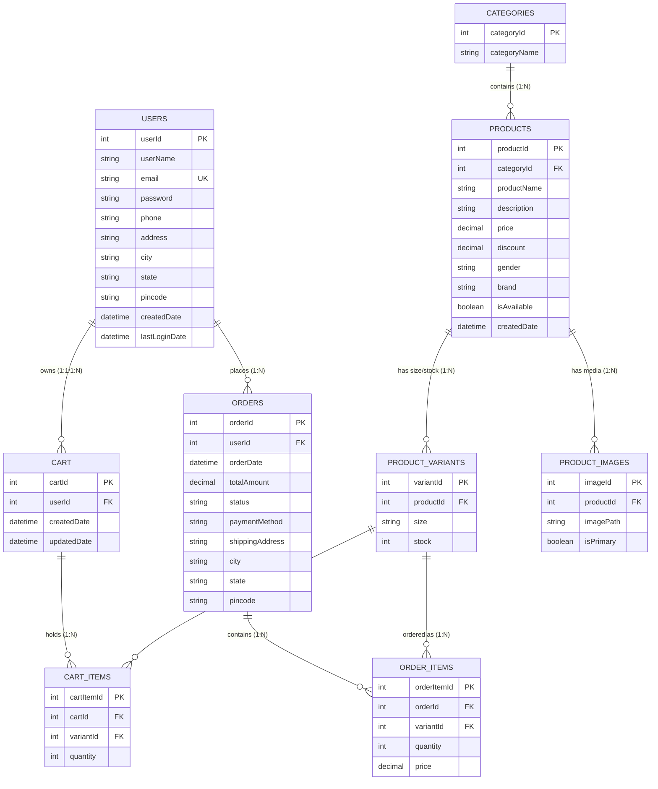

# 🗄️ Database Architecture & Schema Documentation

This document provides complete documentation for the **FashionStore** database schema (`fashion_store`), including entity relationships, column definitions, table constraints, and mappings to Java Model classes.

---

## 🗺️ Entity-Relationship Diagram (ERD)

---

## 📋 Database Tables Specification

### 1. `users` Table
Stores customer credentials, profile details, shipping addresses, and security audit timestamps.

| Column Name | Data Type | Nullable | Default | Constraints | Description |
| :--- | :--- | :--- | :--- | :--- | :--- |
| `userId` | `INT` | No | Auto Increment | **PRIMARY KEY** | Unique user identification |
| `userName` | `VARCHAR(100)` | No | None | None | User's full display name |
| `email` | `VARCHAR(150)` | No | None | **UNIQUE** | Login email identifier |
| `password` | `VARCHAR(255)` | No | None | BCrypt Hash | Hashed user password |
| `phone` | `VARCHAR(20)` | Yes | NULL | None | Contact telephone number |
| `address` | `TEXT` | Yes | NULL | None | Default delivery street address |
| `city` | `VARCHAR(100)` | Yes | NULL | None | Delivery city |
| `state` | `VARCHAR(100)` | Yes | NULL | None | Delivery state/province |
| `pincode` | `VARCHAR(20)` | Yes | NULL | None | Postal / ZIP code |
| `createdDate` | `TIMESTAMP` | No | `CURRENT_TIMESTAMP` | None | Account creation timestamp |
| `lastLoginDate`| `TIMESTAMP` | Yes | NULL | None | Timestamp of last successful login |

---

### 2. `categories` Table
Catalog categories (e.g., T-Shirts, Jeans, Jackets, Shirts).

| Column Name | Data Type | Nullable | Default | Constraints | Description |
| :--- | :--- | :--- | :--- | :--- | :--- |
| `categoryId` | `INT` | No | Auto Increment | **PRIMARY KEY** | Unique category identification |
| `categoryName` | `VARCHAR(100)` | No | None | **UNIQUE** | Category display name |

---

### 3. `products` Table
Core product catalog definitions containing pricing, brand, gender, and availability.

| Column Name | Data Type | Nullable | Default | Constraints | Description |
| :--- | :--- | :--- | :--- | :--- | :--- |
| `productId` | `INT` | No | Auto Increment | **PRIMARY KEY** | Unique product identifier |
| `categoryId` | `INT` | No | None | **FOREIGN KEY** -> `categories.categoryId` | Product classification |
| `productName` | `VARCHAR(255)` | No | None | None | Product title |
| `description` | `TEXT` | Yes | NULL | None | Full product description |
| `price` | `DECIMAL(10,2)` | No | None | None | Base price before discount |
| `discount` | `DECIMAL(5,2)` | Yes | `0.00` | None | Percentage or monetary discount |
| `gender` | `VARCHAR(20)` | Yes | NULL | Men / Women / Unisex | Target gender demographic |
| `brand` | `VARCHAR(100)` | Yes | NULL | None | Brand manufacturer name |
| `isAvailable` | `BOOLEAN` | No | `TRUE` | None | Active listing flag |
| `createdDate` | `TIMESTAMP` | No | `CURRENT_TIMESTAMP` | None | Product creation timestamp |

---

### 4. `product_variants` Table
Inventory table defining specific size options and available stock quantities for each product.

| Column Name | Data Type | Nullable | Default | Constraints | Description |
| :--- | :--- | :--- | :--- | :--- | :--- |
| `variantId` | `INT` | No | Auto Increment | **PRIMARY KEY** | Unique variant identifier |
| `productId` | `INT` | No | None | **FOREIGN KEY** -> `products.productId` | Parent product reference |
| `size` | `VARCHAR(20)` | No | None | S, M, L, XL, XXL, etc. | Apparel size specification |
| `stock` | `INT` | No | `0` | `stock >= 0` | Available real-time inventory count |

---

### 5. `product_images` Table
Product media asset storage paths and primary banner flag.

| Column Name | Data Type | Nullable | Default | Constraints | Description |
| :--- | :--- | :--- | :--- | :--- | :--- |
| `imageId` | `INT` | No | Auto Increment | **PRIMARY KEY** | Unique image record ID |
| `productId` | `INT` | No | None | **FOREIGN KEY** -> `products.productId` | Parent product reference |
| `imagePath` | `VARCHAR(550)` | No | None | Relative web URL | File path to image asset |
| `isPrimary` | `BOOLEAN` | No | `FALSE` | None | Main catalog display thumbnail flag |

---

### 6. `cart` Table
Active shopping cart instance per registered user.

| Column Name | Data Type | Nullable | Default | Constraints | Description |
| :--- | :--- | :--- | :--- | :--- | :--- |
| `cartId` | `INT` | No | Auto Increment | **PRIMARY KEY** | Unique shopping cart ID |
| `userId` | `INT` | No | None | **FOREIGN KEY** -> `users.userId` | Owner user reference |
| `createdDate` | `TIMESTAMP` | No | `CURRENT_TIMESTAMP` | None | Cart creation timestamp |
| `updatedDate` | `TIMESTAMP` | Yes | `CURRENT_TIMESTAMP` | ON UPDATE `CURRENT_TIMESTAMP` | Last cart modification timestamp |

---

### 7. `cart_items` Table
Individual line items inside an active shopping cart.

| Column Name | Data Type | Nullable | Default | Constraints | Description |
| :--- | :--- | :--- | :--- | :--- | :--- |
| `cartItemId` | `INT` | No | Auto Increment | **PRIMARY KEY** | Unique cart item ID |
| `cartId` | `INT` | No | None | **FOREIGN KEY** -> `cart.cartId` | Parent cart reference |
| `variantId` | `INT` | No | None | **FOREIGN KEY** -> `product_variants.variantId` | Selected size/stock variant ID |
| `quantity` | `INT` | No | `1` | `quantity > 0` | Selected unit quantity |

---

### 8. `orders` Table
Completed customer purchase transactions with total amounts and delivery destination.

| Column Name | Data Type | Nullable | Default | Constraints | Description |
| :--- | :--- | :--- | :--- | :--- | :--- |
| `orderId` | `INT` | No | Auto Increment | **PRIMARY KEY** | Unique order transaction ID |
| `userId` | `INT` | No | None | **FOREIGN KEY** -> `users.userId` | Customer user reference |
| `orderDate` | `TIMESTAMP` | No | `CURRENT_TIMESTAMP` | None | Order placement timestamp |
| `totalAmount` | `DECIMAL(10,2)` | No | None | None | Grand total (Subtotal + Shipping) |
| `status` | `VARCHAR(50)` | No | `Pending` | Pending / Processing / Shipped / Delivered | Order fulfillment lifecycle status |
| `paymentMethod`| `VARCHAR(50)` | No | `COD` | COD / Credit Card / UPI | Customer payment method chosen |
| `shippingAddress`| `TEXT` | No | None | None | Street delivery address at purchase |
| `city` | `VARCHAR(100)` | No | None | None | Destination city |
| `state` | `VARCHAR(100)` | No | None | None | Destination state |
| `pincode` | `VARCHAR(20)` | No | None | None | Destination ZIP code |

---

### 9. `order_items` Table
Immutable order item snapshot records linking orders to specific variants and frozen prices.

| Column Name | Data Type | Nullable | Default | Constraints | Description |
| :--- | :--- | :--- | :--- | :--- | :--- |
| `orderItemId` | `INT` | No | Auto Increment | **PRIMARY KEY** | Unique line item record ID |
| `orderId` | `INT` | No | None | **FOREIGN KEY** -> `orders.orderId` | Parent order transaction |
| `variantId` | `INT` | No | None | **FOREIGN KEY** -> `product_variants.variantId` | Purchased product variant ID |
| `quantity` | `INT` | No | None | `quantity > 0` | Units purchased |
| `price` | `DECIMAL(10,2)` | No | None | Snapshot unit price | Unit price locked at time of order |

---

## 🔗 Table Foreign Key Relationships Summary

| Parent Table | Primary Key | Child Table | Foreign Key | Relationship Type | Delete/Update Cascade Rule |
| :--- | :--- | :--- | :--- | :--- | :--- |
| `users` | `userId` | `cart` | `userId` | 1-to-1 / 1-to-Many | CASCADE on delete |
| `users` | `userId` | `orders` | `userId` | 1-to-Many | RESTRICT on delete |
| `categories` | `categoryId` | `products` | `categoryId` | 1-to-Many | RESTRICT on delete |
| `products` | `productId` | `product_variants` | `productId` | 1-to-Many | CASCADE on delete |
| `products` | `productId` | `product_images` | `productId` | 1-to-Many | CASCADE on delete |
| `cart` | `cartId` | `cart_items` | `cartId` | 1-to-Many | CASCADE on delete |
| `product_variants` | `variantId` | `cart_items` | `variantId` | 1-to-Many | CASCADE on delete |
| `orders` | `orderId` | `order_items` | `orderId` | 1-to-Many | CASCADE on delete |
| `product_variants` | `variantId` | `order_items` | `variantId` | 1-to-Many | RESTRICT on delete |

---

## 🔄 Domain Model to SQL Table Mapping Matrix

| Java Entity Class | Database Table | Primary Attribute | SQL Column | Attribute Data Type | Java Accessors |
| :--- | :--- | :--- | :--- | :--- | :--- |
| `com.fashionstore.model.User` | `users` | `userId` | `userId` | `int` | `getUserId()` / `setUserId(int)` |
| | | `userName` | `userName` | `String` | `getUserName()` / `setUserName(String)` |
| | | `email` | `email` | `String` | `getEmail()` / `setEmail(String)` |
| | | `password` | `password` | `String` | `getPassword()` / `setPassword(String)` |
| | | `phone` | `phone` | `String` | `getPhone()` / `setPhone(String)` |
| | | `address` | `address` | `String` | `getAddress()` / `setAddress(String)` |
| | | `city` | `city` | `String` | `getCity()` / `setCity(String)` |
| | | `state` | `state` | `String` | `getState()` / `setState(String)` |
| | | `pincode` | `pincode` | `String` | `getPincode()` / `setPincode(String)` |
| | | `createdDate` | `createdDate` | `LocalDateTime` | `getCreatedDate()` / `setCreatedDate(...)` |
| | | `lastLoginDate`| `lastLoginDate`| `LocalDateTime` | `getLastLoginDate()` / `setLastLoginDate(...)` |
| `com.fashionstore.model.Category` | `categories` | `categoryId` | `categoryId` | `int` | `getCategoryId()` / `setCategoryId(int)` |
| | | `categoryName` | `categoryName` | `String` | `getCategoryName()` / `setCategoryName(...)` |
| `com.fashionstore.model.Product` | `products` | `productId` | `productId` | `int` | `getProductId()` / `setProductId(int)` |
| | | `categoryId` | `categoryId` | `int` | `getCategoryId()` / `setCategoryId(int)` |
| | | `productName` | `productName` | `String` | `getProductName()` / `setProductName(...)` |
| | | `description` | `description` | `String` | `getDescription()` / `setDescription(...)` |
| | | `price` | `price` | `BigDecimal` | `getPrice()` / `setPrice(BigDecimal)` |
| | | `discount` | `discount` | `BigDecimal` | `getDiscount()` / `setDiscount(BigDecimal)` |
| | | `gender` | `gender` | `String` | `getGender()` / `setGender(String)` |
| | | `brand` | `brand` | `String` | `getBrand()` / `setBrand(String)` |
| | | `isAvailable` | `isAvailable` | `boolean` | `isAvailable()` / `setAvailable(boolean)` |
| `com.fashionstore.model.ProductVariant`| `product_variants` | `variantId` | `variantId` | `int` | `getVariantId()` / `setVariantId(int)` |
| | | `productId` | `productId` | `int` | `getProductId()` / `setProductId(int)` |
| | | `size` | `size` | `String` | `getSize()` / `setSize(String)` |
| | | `stock` | `stock` | `int` | `getStock()` / `setStock(int)` |
| `com.fashionstore.model.ProductImage` | `product_images` | `imageId` | `imageId` | `int` | `getImageId()` / `setImageId(int)` |
| | | `productId` | `productId` | `int` | `getProductId()` / `setProductId(int)` |
| | | `imagePath` | `imagePath` | `String` | `getImagePath()` / `setImagePath(...)` |
| | | `isPrimary` | `isPrimary` | `boolean` | `isPrimary()` / `setPrimary(boolean)` |
| `com.fashionstore.model.Cart` | `cart` | `cartId` | `cartId` | `int` | `getCartId()` / `setCartId(int)` |
| | | `userId` | `userId` | `int` | `getUserId()` / `setUserId(int)` |
| | | `createdDate` | `createdDate` | `LocalDateTime` | `getCreatedDate()` / `setCreatedDate(...)` |
| `com.fashionstore.model.CartItem` | `cart_items` | `cartItemId` | `cartItemId` | `int` | `getCartItemId()` / `setCartItemId(int)` |
| | | `cartId` | `cartId` | `int` | `getCartId()` / `setCartId(int)` |
| | | `variantId` | `variantId` | `int` | `getVariantId()` / `setVariantId(int)` |
| | | `quantity` | `quantity` | `int` | `getQuantity()` / `setQuantity(int)` |
| `com.fashionstore.model.Order` | `orders` | `orderId` | `orderId` | `int` | `getOrderId()` / `setOrderId(int)` |
| | | `userId` | `userId` | `int` | `getUserId()` / `setUserId(int)` |
| | | `totalAmount` | `totalAmount` | `BigDecimal` | `getTotalAmount()` / `setTotalAmount(...)` |
| | | `status` | `status` | `String` | `getStatus()` / `setStatus(String)` |
| | | `paymentMethod`| `paymentMethod`| `String` | `getPaymentMethod()` / `setPaymentMethod(...)` |
| | | `shippingAddress`| `shippingAddress`| `String` | `getShippingAddress()` / `setShippingAddress(...)` |
| | | `city` | `city` | `String` | `getCity()` / `setCity(String)` |
| | | `state` | `state` | `String` | `getState()` / `setState(String)` |
| | | `pincode` | `pincode` | `String` | `getPincode()` / `setPincode(String)` |
| `com.fashionstore.model.OrderItem` | `order_items` | `orderItemId` | `orderItemId` | `int` | `getOrderItemId()` / `setOrderItemId(int)` |
| | | `orderId` | `orderId` | `int` | `getOrderId()` / `setOrderId(int)` |
| | | `variantId` | `variantId` | `int` | `getVariantId()` / `setVariantId(int)` |
| | | `quantity` | `quantity` | `int` | `getQuantity()` / `setQuantity(int)` |
| | | `price` | `price` | `BigDecimal` | `getPrice()` / `setPrice(BigDecimal)` |
